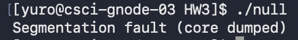
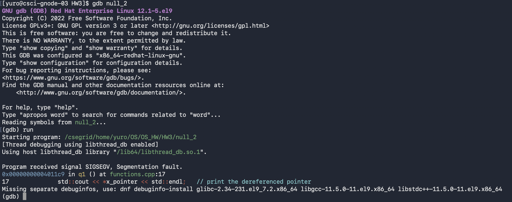
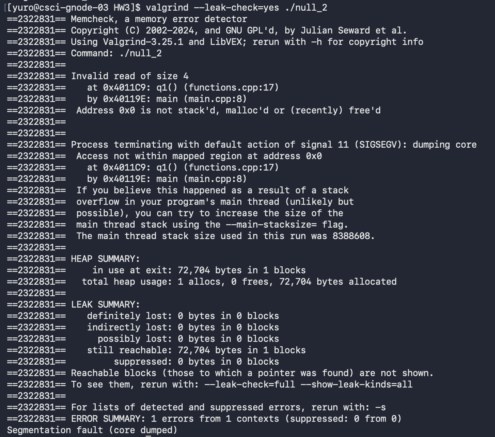
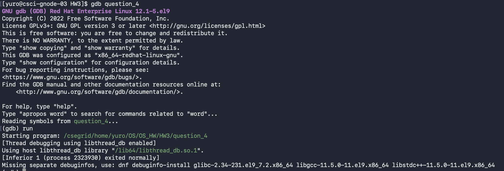
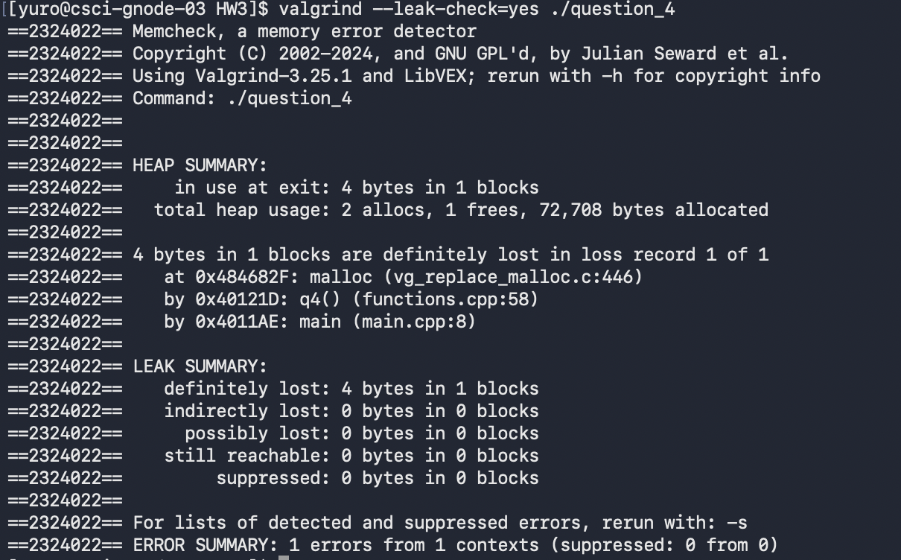
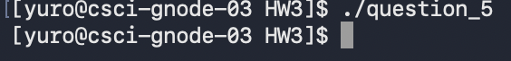
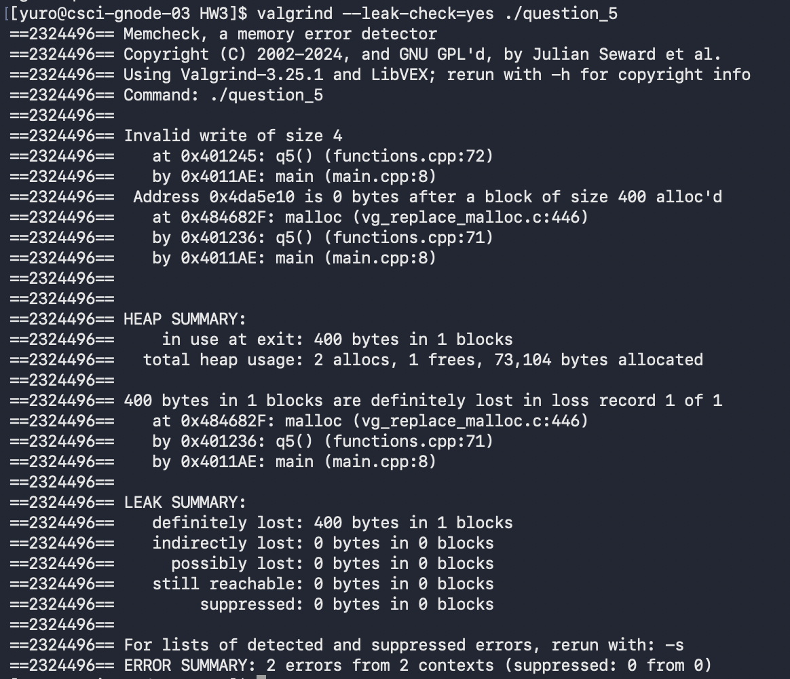
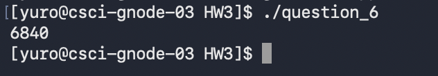
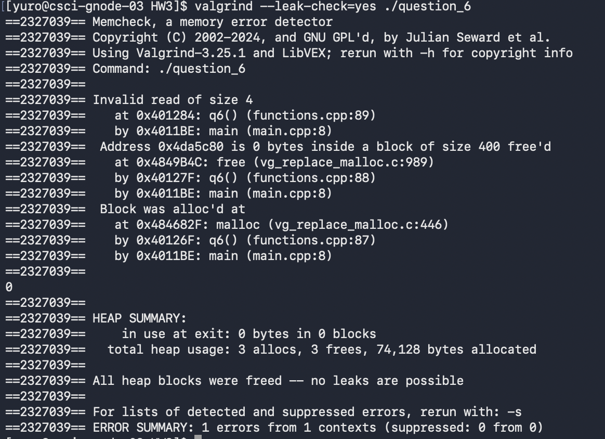
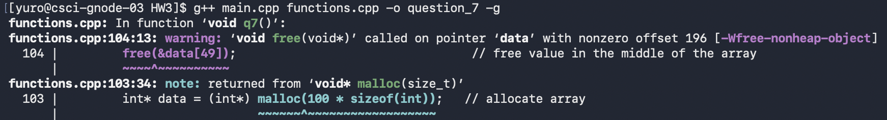

# HW3

### Question 1

> When trying to run the program null, a segmentation fault occured

### Question 2

> After recompiling with "-g" flag for more info and running with gdp, gdp shows a segmentation fault occured

### Question 3

> After running the program with valgrind, it gives a report of what occured when running the program, as well as heap, leak, and error summaries.
>
> This report says that in invalid read was attempted and where.
> It also says how the process was terminated (due to a segmentation fault signal).

### Question 4

> When running the program with gdb, no errors are shown.

> However when running with valgrind, it picks up that the heap memory wasn't freed before exiting. 

### Question 5

> When the program for question 5 is run, the program exits normally.

> However, when run with valgrind, it notifies of an invalid write of size 4 due to no bytes after the block size of 400 that was allocated. i.e. an out of bounds write.

### Question 6

> When the program is run, a garbage value is printed

> When run with valgrind, it notifies of an invalid read due to no bytes in a block that was free'd. 

### Question 7

> For this case, no tool is needed, the compiler notifies that a pointer that wasn't the original pointer allocated tried to be freed.

